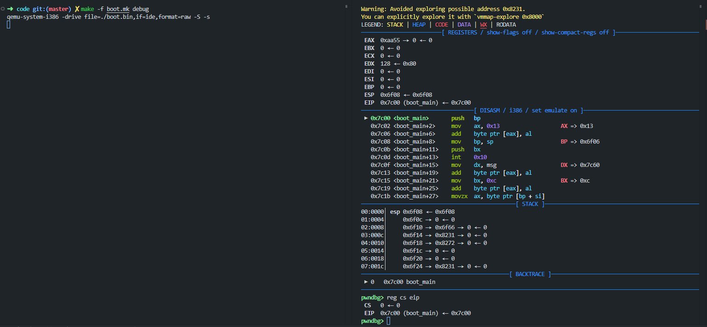

# boot 实现

本目录展示如何用 **C + 内联汇编 + 自定义链接脚本** 构建一个 512 字节 BIOS 启动扇区：进入 VGA 0x13 模式并输出一行文本后停机。

## 启动流程概述

1. BIOS 从启动顺序设备读取 LBA 0 第一个扇区 (512 字节) 到内存 0x0000:0x7C00 (物理 0x7C00)，检查末尾 2 字节是否为 0x55AA。
2. 若有效，跳转到 0x7C00 执行我们编写的引导代码 `_start`。
3. 本程序初始化段寄存器与栈 → 切换视频模式 0x13 → 打印字符串 → `HLT` 循环。

## 代码文件结构

| 文件 | 作用 |
|------|------|
| `boot.c` | 引导主体逻辑 (初始化 + BIOS 调用 + 打印) |
| `boot.ld` | 链接脚本：内存布局、签名位置、大小断言 |
| `boot.mk` | 构建流程 (编译→链接→裁剪→运行) |

## 相关知识点补充

### gcc 内联汇编

本项目里大量依赖 **GCC 扩展内联汇编 (Extended Inline Assembly)** 来直接访问 BIOS / 设置段寄存器。理解其语法与约束，能避免很多“莫名其妙的编译或运行错误”。下面总结最常用、且与 16 位引导程序直接相关的知识点。

#### 基本格式

```c
__asm__ volatile (
    "指令串\n"
    : 输出约束列表          /* 可为空 */
    : 输入约束列表          /* 可为空 */
    : “破坏(被修改)寄存器/内存” 列表
);
```

四段用冒号分隔；缺省可留空但冒号要保留。`volatile` 告诉编译器：不要因为看似“无副作用”而优化掉或重排这段指令。

#### AT&T 语法速记

| 要素 | 规则 | 示例 |
|------|------|------|
| 指令操作数顺序 | 源, 目的 | `movw %ax, %ds` |
| 立即数 | 以 `$` 前缀 | `$0x13` |
| 寄存器 | 以 `%` 前缀 | `%ax` |
| 宽度后缀 | b=8, w=16, l=32 (本项目用 b/w) | `movw`, `int $0x10` |
| 内存操作 | `disp(base,index,scale)` | `(%si)`, `msg(%bp)` |

#### 约束 (constraints) 基础

| 约束 | 含义 | 适用示例 |
|-------|------|----------|
| `r` | 任意通用寄存器 (gcc 选) | `: "r"(val)` |
| `i` | 立即数常量 | `: "i"(0x13)` |
| `a`/`b`/`c`/`d`/`S`/`D` | 指定 AX/BX/CX/DX/SI/DI | `: "a"(0x1301)` |
| `m` | 内存操作数 | 很少在 16 位简短序列中用 |
| `"=&r"` | 早期被修改的输出 (early clobber) | 多指令写同一输出 |
| `"+r"` | 既作输入又作输出 (读-改-写) | 计数器/累加器 |

常见写法：

```c
int ch = 'A';
__asm__ volatile ("int $0x10" : : "a"(0x0e00 | ch), "b"(0x0000));
```

说明：把 `AX=0x0E??` (Teletype 输出)，`BX` 页=0 颜色=0，然后触发 BIOS 视频中断。

#### Clobber 列表与 `memory`

若汇编修改了未出现在输出约束中的寄存器，必须放入 **clobber 列表**，否则 GCC 可能错误复用寄存器导致逻辑错：

```c
__asm__ volatile ("movw %0, %%ds" : : "r"(seg) : "memory", "ds");
```

`"memory"` 表示此汇编可能读/写任意内存，禁止编译器把前后的内存访问重排；对端口 I/O、访问显存、BIOS 调用后期望结果已落内存时常加。

#### 向段寄存器写值

段寄存器只能来源通用寄存器：

```c
static inline void set_ds(unsigned short seg) {
    __asm__ volatile ("movw %0, %%ds" : : "r"(seg) : "memory", "ds");
}
```

若要一次设置多个：拆成多条或放同一 `asm` 块里，减少寄存器分配波动。

#### 多行写法与自动换行

用 `\n` 分隔指令，最后一行可省略 `\n`；建议加 `\n\t` 让反汇编更整洁：

```c
__asm__ volatile (
    "xor %%ax, %%ax\n\t"
    "mov %%ax, %%ds\n\t"
    "mov %%ax, %%es"
);
```

#### 远跳 (far jump) 与代码段同步

修改 `CS` 只能通过 *远控制转移*：

```c
__asm__ volatile ("ljmp $0x7C0, $next_label\nnext_label:");
```

通常我们让链接脚本把加载地址直接等于执行地址 (恒 =0x7C00)，可避免切换 `CS` 的麻烦。只有在“搬移自身”或“进入保护模式”前需要精确远跳。

#### 使用输出约束收集结果

从 BIOS 取值：

```c
unsigned short cursor_pos;
__asm__ volatile (
    "int $0x10"
    : "=d"(cursor_pos)              /* 取 DX (行列信息) */
    : "a"(0x0300), "b"(0x0000)
    : "cx"
);
```

### 8086 寄存器与 16 位实模式

#### 通用寄存器 (General Purpose)

| 16位 | 高 8 位 | 低 8 位 | 常见用途 |
|------|---------|---------|----------|
| AX   | AH      | AL      | 累加器 / I/O / 中断功能号 (例如 int 10h: AH=功能, AL=数据) |
| BX   | BH      | BL      | 基址寄存器 / 一些 BIOS 调用里 BH=页, BL=颜色/属性 |
| CX   | CH      | CL      | 计数 (循环/字符串操作, shift 指令使用 CL) |
| DX   | DH      | DL      | 端口号 / 乘除法扩展 / BIOS 某些调用传递驱动器号 (DL) |

#### 索引与指针寄存器

| 寄存器 | 作用 |
|--------|------|
| SP     | Stack Pointer, 指向当前栈顶 (push 之前、pop 之后) |
| BP     | Base Pointer, 常用于基于栈的局部变量/参数访问 |
| SI     | Source Index, 串指令源地址 (例如 `lodsb`) |
| DI     | Destination Index, 串指令目标地址 (例如 `stosb` / `movsw`) |

#### 段寄存器 (Segment)

| 寄存器 | 含义 |
|--------|------|
| CS     | Code Segment, 取指使用 (CS:IP)；修改通常通过 far jump/ret/int |
| DS     | Data Segment, 大部分未显式带段前缀的数据访问默认使用 |
| SS     | Stack Segment, push/pop/调用指令使用 (与 SP 配合) |
| ES     | Extra Segment, 串指令目标段 (如 `movsw` 默认使用 ES:DI) |
| FS/GS  | 8086 无, 80386+ 引入; 在“实模式”下仍可当普通段寄存器使用 |

#### 其他关键寄存器

| 寄存器 | 说明 |
|--------|------|
| IP     | Instruction Pointer, 指向下一条将被取指的偏移 |
| FLAGS  | 标志寄存器, 包含 CF/ZF/SF/IF/DF 等; 我们用到的主要是 IF (中断允许标志) |

实模式下 CPU 采用 20 位物理地址线 (A0~A19)，物理地址计算公式:

```text
Physical = Segment * 16 + Offset  (即 Segment << 4 + Offset)
```

示例: CS=0x7C0, IP=0x0000 → 物理地址 = 0x7C0 * 16 = 0x7C00。

#### 常用汇编指令 （AT&T）

为后续写引导 / 第二阶段加载器常用的 16 位指令速查。语法均为 AT&T (源, 目的)。

##### 数据传送与栈

| 指令 | 功能 | 示例 | 备注 |
|------|------|------|------|
| `mov` | 基本传送 | `mov $0x13, %al` | 立即数/寄存器/内存，不能内存→内存直传 |
| `xchg` | 交换 | `xchg %ax, %bx` | 避免临时寄存器 |
| `lea` | 取有效地址 | `lea msg, %si` | 不访问内存，只做地址计算 |
| `push` | 压栈 SP-=2 | `push %ax` | 段寄存器也可 `push %ds` |
| `pop` | 出栈 SP+=2 | `pop %ds` | 给段寄存器赋值常用 |
| `pusha` | 压 AX..DI |  | 8086 顺序: AX CX DX BX SP BP SI DI |
| `popa`  | 恢复寄存器 |  | 与 `pusha` 配对 |
| `movsb/movsw` | 串搬运 | `rep movsb` | DS:SI→ES:DI，受 DF 方向影响 |
| `lodsb/lodsw` | 串读 | `lodsb` | DS:SI→AL/AX，SI 自增/减 |
| `stosb/stosw` | 串写 | `rep stosb` | AL/AX→ES:DI |

##### 算术 / 逻辑

| 指令 | 功能 | 示例 | 标志 |
|------|------|------|------|
| `add/sub` | 加减 | `add $1, %al` | 影响 CF/ZF/SF/OF 等 |
| `inc/dec` | 自增减 | `inc %cx` | 不改 CF |
| `mul/imul` | 乘法 | `mul %bl` | 结果在 AX 或 DX:AX |
| `div/idiv` | 除法 | `div %bl` | AX 被除, 商 AL 余 AH (8 位) |
| `and/or/xor` | 位逻辑 | `xor %ax, %ax` | 清零惯用法 |
| `not/neg` | 位取反/取负 | `neg %ax` | `neg` = 求二补码 |
| `cmp` | 比较 | `cmp $0, %al` | 仅设标志，常跟条件跳转 |
| `test` | 与并丢结果 | `test %al, %al` | 判零/符号 |

##### 位移 / 旋转

| 指令 | 功能 | 备注 |
|------|------|------|
| `shl/sal` | 左移 | 左移=乘 2 |
| `shr` | 逻辑右移 | 高位补 0 |
| `sar` | 算术右移 | 符号扩展 |
| `rol/ror` | 循环左/右 | 不含 CF (但更新) |
| `rcl/rcr` | 带进位循环 | 纳入 CF 形成 17/33 位循环 |

##### 控制流与中断

| 指令 | 功能 | 示例 |
|------|------|------|
| `jmp` | 无条件跳转 | `jmp label` / 远跳 `ljmp $seg,$off` |
| `call` | 调用 | `call print_char` |
| `ret` | 返回 | 弹 IP (远返回 `retf` 弹 CS:IP) |
| `int` | 软中断 | `int $0x10` BIOS 视频 |
| `iret` | 中断返回 | 弹标志+CS:IP |
| `loop` | CX--!=0 跳 | `loop again` |
| 条件跳转 | 按标志 | `jz/jnz/jc/ja/...` |

条件跳转详解 (cmp / test 之后如何选指令)

`cmp L,R` 逻辑：计算 (L - R) 只更新标志，不写回。核心标志：
ZF=结果为0；CF=无符号借位(L<R)；SF=符号位；OF=有符号溢出；PF=低8位偶校验。

无符号关系 (after `cmp L,R`)：

- `<`  : `jb` / `jc`   (CF=1)
- `<=` : `jbe`         (CF=1 or ZF=1)
- `>`  : `ja`          (CF=0 and ZF=0)
- `>=` : `jae` / `jnb` (CF=0)

有符号关系：利用 (SF xor OF) 判“<”

- `<`  : `jl`          (SF!=OF)
- `<=` : `jle`         (ZF=1 or SF!=OF)
- `>`  : `jg`          (ZF=0 and SF=OF)
- `>=` : `jge`         (SF=OF)

相等/不等：`je/jz` (ZF=1), `jne/jnz` (ZF=0)

标志直接：`jc/jnc` (CF=1/0), `jo/jno` (OF=1/0), `js/jns` (SF=1/0), `jp/jnp` (PF=1/0)。

常混淆：

- `ja` / `jb` 只看无符号；`jg` / `jl` 只用于有符号。
- `jb == jc`（借位=进位）；`jae == jnb`；`jbe == jna`；`ja == jnbe`。
- “带等号”多一个 ZF 条件（或组合 OR ZF / AND ZF=0）。

快速记忆口诀：

```text
无符号：CF=1 ⇒ below，CF=0 且 ZF=0 ⇒ above
有符号：SF xor OF ⇒ less；(SF==OF 且 ZF=0) ⇒ greater
== ⇒ ZF=1；!= ⇒ ZF=0
```

循环类特例：`loop` (CX--, CX!=0 跳)；`loope/loopz` (CX--, CX!=0 且 ZF=1)；`loopne/loopnz` (CX--, CX!=0 且 ZF=0)；`jcxz` (CX=0)；(32/64 位对应 `jecxz`/`jrcxz`)。

若需要把条件变成布尔值写寄存器，可用 `setcc` 家族（`sete/setne/setb/setg/...`）。

实践建议：

1. 先决定比较视角（有符号/无符号）再选跳转助记符。
2. 复杂分支将“最常走路径”作为 fall-through（不要跳）提升预测命中。
3. 先 `cmp` 再紧跟条件跳转，避免中间插入会改标志的指令。

示例：检查一个 16 位有符号值 x 是否在 [-10,10]：

```asm
    mov x, %ax
    cmp $-10, %ax
    jl out_of_range
    cmp $10, %ax
    jg out_of_range
    ; in range
```

示例：无符号范围 0 <= x < n：

```asm
    cmp n, %ax      # (ax - n)
    jae out_of_range  # ax >= n ⇒ 不合法
```

##### 标志/方向/现场

| 指令 | 功能 | 场景 |
|------|------|------|
| `cli/sti` | 关/开 IF | 栈/段初始化期间关中断 |
| `cld/std` | DF=0/1 | 串操作前常用 `cld` |
| `pushf/popf` | 保存/恢复标志 | 进入/退出临界段 |
| `lahf/sahf` | AH↔FLAGS(低) | 快速保存部分标志 |

##### 端口 I/O

| 指令 | 功能 | 示例 |
|------|------|------|
| `in` | 端口读 → AL/AX | `in %dx, %al` |
| `out` | AL/AX → 端口 | `out %al, %dx` |

##### 杂项

| 指令 | 功能 | 用途 |
|------|------|------|
| `hlt` | 等待中断 | 低功耗空转循环 |
| `nop` | 空操作 | 对齐/延迟 |
| `xlat` | 查表 | 少用 |

##### 串操作复制示例

```asm
cld                # 串方向正向
mov $src, %si      # 源地址
mov $dst_seg, %ax  # 目标段
mov %ax, %es
mov $dst_off, %di
mov $len, %cx
rep movsb          # 复制 len 字节
```

##### BIOS 打印循环示例 (与本项目逻辑相同)

```asm
mov $0x13, %ax      # AH=0 AL=0x13 → 图形模式 13h
int $0x10
mov $msg, %si
print_loop:
    lodsb           # AL = [DS:SI++]
    test %al, %al
    jz done
    mov $0x0E, %ah  # teletype
    int $0x10
    jmp print_loop
done:
    hlt
    jmp done
```

#### 0x7C00 的来源

传统 BIOS 把首个启动扇区加载到物理地址 0x7C00（CS:IP 常为 0x0000:0x7C00 或 0x07C0:0x0000，取决于 BIOS 实现）。我们链接脚本直接把代码 VMA/LMA 定位到 0x7C00，保证 objcopy 后生成的二进制开头字节恰好应被放在该地址，无需再重定位。

#### 为什么清零 DS/ES/FS/GS

在 `gcc -m16` 生成的代码里，访问 C 字符串/常量会生成对符号地址的 16 位立即数引用。我们让所有数据段寄存器 = 0，这样“符号的链接地址低 16 位”就是它的物理地址低 16 位 (因为物理 = 0 + offset)。若使用 DS=0x7C0 方案，也可行，但要保证所有对符号的偏移是相对于 0x7C00；保持 DS=0 更直观。

#### 设置栈的注意点

修改 SS 与 SP 最安全的顺序：先 `cli` 关中断 → 更新 SS → 再写 SP → `sti`。在一些复杂情况下(特别是启用 NMI 或使用 BIOS可触发中断的窗口)这样可避免在 SS:SP 不一致时被中断打断。示例中把 SP 设为 0x7C00（演示用途），更安全的做法是放到未覆盖区域（例如 0x9000）。

#### CLI / STI 与 IF 标志

`cli` 清 IF (Interrupt Flag) 禁用可屏蔽中断；`sti` 设置 IF 重新允许。引导早期我们避免在还没准备好栈或环境时被外部中断处理程序打断。

#### 字节序

x86 为小端 (little-endian)：写入 `0xAA55` 到内存将按 55 AA 排列。链接脚本把签名节放到 0x7DFE，常用十六进制转储看到最后两个字节为 `55 aa` 说明有效。

#### 访问字符串的两种常见策略

1. `DS=0x7C0` + 使用偏移 (符号地址 - 0x7C00)。
2. `DS=0` + 直接把链接绝对地址低 16 位当偏移 (本项目采用)。

两者都正确；第二种减少一层“地址转换”思维负担。



#### 关于 FS/GS

虽然 8086 不支持，但现代 CPU 复位后进入实模式依旧可以使用 FS/GS 作为额外通用段寄存器；为避免遗留垃圾值带来意外访问，统一清零是良好习惯。

### int 0x10 中断

BIOS 视频服务中断，功能号放在 AH 寄存器。常用功能：

| AH 功能 | 描述 | 关键输入寄存器 | 关键输出 | 备注 |
|---------|------|----------------|----------|------|
| 0x00 | 设置视频模式 | AL=模式号 (如 0x13) | 无 | 清屏并重设显示缓冲 |
| 0x0E | TTY 打印字符 | AL=字符, BH=页, BL=属性/颜色 | 光标前进 | 最常用文本/图形模式快速输出 |
| 0x02 | 设置光标位置 | BH=页, DH=行, DL=列 | 无 | 文本模式有效 |
| 0x03 | 读取光标位置 | BH=页 | DH=行, DL=列 | 便于恢复 |
| 0x06 | 上卷窗口 | AL=行数, BH=填充属性, (CH,CL, DH,DL)=窗口区域 | 无 | AL=0 ⇒ 全屏 |
| 0x07 | 下卷窗口 | 同 0x06 | 无 | |
| 0x09 | 写字符并属性(重复) | AL=字符, BH=页, BL=属性, CX=次数 | 无 | 文本模式批量填充 |
| 0x0A | 写字符(不改属性, 重复) | AL=字符, BH=页, CX=次数 | 无 | 快速覆盖 |
| 0x10 | 调色板/ DAC | 参见子功能 | 视子功能 | VGA 扩展，高级用 |

最常见入门只需 0x00 (设模式) 与 0x0E (打印字符)。本项目即：

```asm
mov $0x13, %ax   # AH=0x00 AL=0x13 → 320x200 256色
int $0x10

mov $msg, %si
print:
    lodsb
    test %al,%al
    jz done
    mov $0x0E, %ah
    int $0x10
    jmp print
done:
    hlt
```

常用字符颜色

| 颜色 | 值 | 说明 |
|------|----|------|
| 黑 | 0x00 | |
| 蓝 | 0x01 | |
| 绿 | 0x02 | |
| 青 | 0x03 | 蓝+绿 |
| 红 | 0x04 | |
| 紫 | 0x05 | 红+蓝 |
| 黄 | 0x06 | 红+绿 |
| 白 | 0x07 | 红+绿+蓝 |

#### 视频模式概览 (经典部分)

| 模式 | 分辨率 | 色深 | 显存段 | 说明 |
|------|--------|------|--------|------|
| 0x03 | 80x25 文本 | 16 色 (属性) | B800:0000 | 彩色文本模式，2 字节/字符 |
| 0x12 | 640x480 | 16 色 | A000:0000 | 计划式 VGA 图形 |
| 0x13 | 320x200 | 256 色 | A000:0000 | 线性 64KB，学习入门最友好 |

模式 0x13 特点：一字节一像素，显存线性排布：offset = y*320 + x。要直接写像素：

```asm
mov $0xA000, %ax
mov %ax, %es        # ES 指向显存
xor %di, %di        # 例如左上角像素 offset=0
movb $0x04, %es:(%di)  # 写调色板索引 0x04 (通常是红)
```

退出图形模式只需重新设文本模式 0x03：

```asm
mov $0x0003, %ax
int $0x10
```

#### TTY 打印 (AH=0x0E) 细节

| 寄存器 | 用途 |
|--------|------|
| AL | ASCII 字符 (若=0x08 退格, 0x0A 换行, 0x0D 回车等控制符) |
| BH | 页号 (多数情况 0) |
| BL | 前景颜色 (图形模式下通常忽略；文本模式=属性低 4 位) |

行为：自动前进光标；在文本模式中遇到右边界会回行，在图形模式 (13h) 下实现仍由 BIOS 内部以文本光标逻辑叠加（字符绘制为 8x8 字模）。
